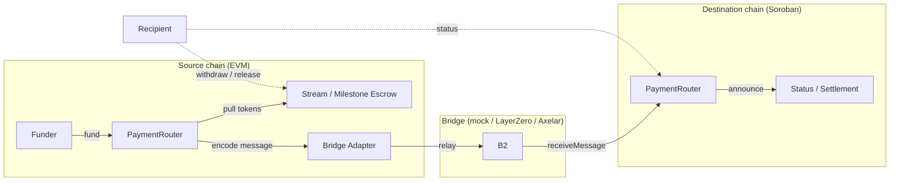

<p align="center">
  
</p>

<h1 align="center">IPay</h1>

<p align="center">
  <strong>Non-custodial, open-source routing for grant, salary, and donation payments across blockchains.</strong>
</p>

<p align="center">
  <a href="LICENSE"></a>
  <a href="https://github.com/vijaymark/ipay/actions/workflows/contracts-test.yml"></a>
  <a href="https://github.com/vijaymark/ipay/actions/workflows/ci.yml"></a>
  <a href="https://codecov.io/gh/vijaymark/ipay"></a>
  <a href="https://github.com/vijaymark/ipay"></a>
</p>

---

## Problem

Grant programs, DAOs, and payroll systems routinely want to send money to a
person or project that lives on a *different* chain. Today that means one
party manually bridges assets, juggles wrapped tokens, or funnels everything
through a single canonical chain — adding steps, fees, and custody risk.

**IPay** is the routing layer for those payments. A funder on
Ethereum can pay a recipient on Stellar (Soroban) in a single flow, and the
protocol handles the cross-chain delivery behind a bridge-agnostic adapter —
without either side ever touching a bridge UI.

### What makes this different

- **Not another bridge.** Bridges (LayerZero, Axelar, Wormhole) move *tokens*.
  This protocol moves *payments*: it encodes the payment's intent, escrows
  funds non-custodially, and settles them on the destination chain. The bridge
  is a swappable transport, not the product.
- **Not another single-chain funding UI.** Superfluid and Sablier do
  world-class *streaming* on one chain; Drips and GrantFox focus on a
  single-chain *funding* experience. This project is the **cross-chain
  routing layer** — the same one-time / streamed / milestone primitives, but
  delivered across chains with replay protection and timeout fallback.
- **Grant-first milestone escrow.** The primary mode is **milestone
  disbursement**: funds locked in escrow, released in tranches by multisig,
  DAO vote, or oracle attestation — with a timeout fallback so a stuck bridge
  can never strand a grant.

## Architecture



The diagram above illustrates the cross-chain payment data flow:

**Source chain (EVM):** A Funder initiates a payment by funding the
PaymentRouter, which pulls tokens into either a Stream Escrow (linear
per-second release) or a Milestone Escrow (tranche-based release), and
simultaneously encodes a CrossChainMessage for the bridge adapter.

**Bridge:** The Bridge Adapter relays the encoded message from the source
chain to the destination chain. The protocol is bridge-agnostic — any of
mock, LayerZero, or Axelar can be used.

**Destination chain (Soroban):** The destination PaymentRouter receives the
message via `receiveMessage`, records the announcement for status queries,
and the Recipient can withdraw from the escrow or check payment status.

Every payment is described once in a canonical message format
(`docs/PROTOCOL_SPEC.md` §4), escrowed on the source chain, and announced on
the destination chain. Escrow logic never knows which bridge carried the
message.

## Payment primitives

| Primitive | Description |
| --------- | ----------- |
| **One-time** | Amount + token + destination chain + recipient, delivered once. |
| **Stream** | Linear per-second release, withdrawable anytime, cancelable by sender with pro-rata settlement. |
| **Milestone** | Funds locked in escrow, released in tranches via multisig, DAO vote, or oracle. Primary mode for grants. |

## Repo layout

```
ipay/
├── contracts/        Solidity (Foundry) — router, escrows, mock + Axelar bridge adapters
├── soroban/          Rust (Soroban) — mirror of the EVM contracts
├── soroban-axelar/   Rust (Soroban) — Axelar GMP bridge adapter
├── sdk/              TypeScript SDK — chain-agnostic client
├── app/              Reference Next.js frontend
├── docs/             ARCHITECTURE, PROTOCOL_SPEC, SECURITY, ROADMAP
├── scripts/          Deploy + verify scripts per chain
├── assets/logo/      Branding
└── .github/workflows CI
```

## Quickstart

### 1. EVM contracts (Foundry)

```bash
curl -L https://foundry.paradigm.xyz | bash
foundryup
cd contracts
forge install foundry-rs/forge-std
forge test          # 132 tests
forge coverage --ir-minimum   # 90.6% line / 89.3% branch
```

### 2. Soroban contracts (Rust)

```bash
rustup target add wasm32v1-none
cd soroban
cargo test          # 19 tests
cargo build --release --target wasm32v1-none
```

### 3. TypeScript SDK

The repo is an npm workspace (`sdk/` + `app/`); install once at the root.

```bash
npm install
npm test -w @ipay/sdk   # 10 tests (incl. Anvil integration)
npm run build -w @ipay/sdk
```

### 4. Reference frontend

```bash
npm run build -w @ipay/sdk   # app consumes the built SDK
npm run dev -w @ipay/app
```

### 5. SDK usage

```ts
import { CrossChainClient, EVMChainAdapter, CHAIN_IDS } from "@ipay/sdk";

const client = new CrossChainClient([new EVMChainAdapter({ /* ... */ })]);

const { messageId, escrowAddress } = await client.streamPayment(CHAIN_IDS.ETHEREUM, {
  sender, token, destToken, amount, recipient,
  destChainId: CHAIN_IDS.STELLAR, duration: 30 * 24 * 3600, timeout,
});
```

## Security

The bridge adapter is the single trust boundary; escrow accounting is
independent of it and covered by on-chain tests. **These contracts are
unaudited** and intended for testnet use only. Read the full threat model and
responsible-disclosure instructions in [`SECURITY.md`](SECURITY.md) and
[`docs/SECURITY.md`](docs/SECURITY.md).

## Roadmap

MVP (mock bridge) → real-bridge testnet integration (Axelar GMP adapter is
implemented — see [`docs/AXELAR_BRIDGE.md`](docs/AXELAR_BRIDGE.md)) → third
chain → external audit → mainnet. See [`docs/ROADMAP.md`](docs/ROADMAP.md).

## License

[MIT](LICENSE)
