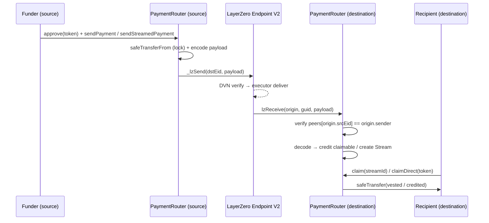

# CrossPay

CrossPay is a cross-chain payments protocol that lets a sender on one chain pay
a recipient on another — as an instant transfer or a linearly-vested streamed
payment — without the recipient holding source-chain gas, running a bridge UI,
or doing anything beyond calling `claim()`. Built on **LayerZero V2** (OApp
standard) and **Foundry**, targeting **Ethereum Sepolia** and **Base Sepolia**.

## Architecture



The same `PaymentRouter` bytecode is deployed on both chains, each registered as
the other's LayerZero peer. On send, the router locks the sender's tokens and
dispatches a versioned payload over LayerZero. On receive, it verifies the peer,
decodes, and credits a claimable balance (direct) or creates a vesting `Stream`.
The recipient then calls `claim`/`claimDirect` to withdraw. Payment logic is
isolated from the transport behind `ICrossChainTransport`, so LayerZero can be
swapped for CCIP/Hyperlane without touching the accounting. Full detail in
[`docs/architecture.md`](docs/architecture.md).

## Prerequisites

Install Foundry:

```bash
curl -L https://foundry.paradigm.xyz | bash
foundryup
```

You'll need a wallet (EOA) with testnet ETH on **both** chains for deploys,
peer-wiring, and message fees.

## Testnet ETH faucets

- **Ethereum Sepolia** — [Alchemy Sepolia Faucet](https://www.alchemy.com/faucets/ethereum-sepolia),
  [Sepolia PoW Faucet](https://sepolia-faucet.pk910.de/), or [QuickNode Faucet](https://faucet.quicknode.com/ethereum/sepolia).
- **Base Sepolia** — [Coinbase Faucet](https://www.coinbase.com/faucets/base-sepolia-faucet) or
  [Alchemy Base Sepolia Faucet](https://www.alchemy.com/faucets/base-sepolia).

LayerZero V2 identifiers used here (see [LayerZero deployments](https://docs.layerzero.network/v2/deployments/deployed-contracts)):

| Chain | Endpoint V2 | Endpoint ID (EID) | Chain ID |
| ----- | ----------- | ----------------- | -------- |
| Ethereum Sepolia | `0x6EDCE65403992e310A62460808c4b910D972f10f` | `40161` | `11155111` |
| Base Sepolia     | `0x6EDCE65403992e310A62460808c4b910D972f10f` | `40245` | `84532` |

## Setup

```bash
git clone <this-repo> && cd crosspay

forge install foundry-rs/forge-std --no-commit
forge install OpenZeppelin/openzeppelin-contracts@v5.0.2 --no-commit
forge install LayerZero-Labs/devtools --no-commit
forge install LayerZero-Labs/LayerZero-v2 --no-commit
forge install GNSPS/solidity-bytes-utils --no-commit
# …or: make install-deps

cp .env.example .env   # then fill in PRIVATE_KEY, OWNER, and both RPC URLs
```

## Build & test

```bash
forge build

forge test -vvv

forge coverage                          # line/branch coverage
make coverage                           # fails if PaymentRouter.sol < 90% line coverage
```

Quality gates (also run in CI): `forge fmt --check`, `forge build`, `forge test`,
`scripts/coverage.sh 90`, and `slither . --config-file slither.config.json`.

## Deploy

Run once per chain. The script picks the LayerZero endpoint from `block.chainid`.

```bash
# Ethereum Sepolia
forge script script/Deploy.s.sol --rpc-url $SEPOLIA_RPC_URL --broadcast --verify \
  --etherscan-api-key $ETHERSCAN_API_KEY

# Base Sepolia
forge script script/Deploy.s.sol --rpc-url $BASE_SEPOLIA_RPC_URL --broadcast --verify \
  --etherscan-api-key $BASESCAN_API_KEY
```

Paste the printed `MockUSDC`/`PaymentRouter` addresses into `.env`
(`SEPOLIA_USDC_ADDR`, `BASE_SEPOLIA_USDC_ADDR`, `SEPOLIA_ROUTER_ADDR`,
`BASE_SEPOLIA_ROUTER_ADDR`).

## Wire peers

Run once per chain, after both deployments exist:

```bash
# On Sepolia (wires Sepolia -> Base)
forge script script/SetPeers.s.sol --rpc-url $SEPOLIA_RPC_URL --broadcast

# On Base Sepolia (wires Base -> Sepolia)
forge script script/SetPeers.s.sol --rpc-url $BASE_SEPOLIA_RPC_URL --broadcast
```

## Send a real testnet payment

Fund the destination router first (it pays claims out of its own balance):

```bash
# mint 1000 mUSDC to the Base Sepolia router
cast send $BASE_SEPOLIA_USDC_ADDR "mint(address,uint256)" $BASE_SEPOLIA_ROUTER_ADDR 1000000000 \
  --rpc-url $BASE_SEPOLIA_RPC_URL --private-key $PRIVATE_KEY
```

Then send from Sepolia (script mints → approves → quotes → sends):

```bash
ROUTER_ADDRESS=$SEPOLIA_ROUTER_ADDR TOKEN_ADDRESS=$SEPOLIA_USDC_ADDR \
RECIPIENT_ADDRESS=0x<recipient> DST_EID=40245 AMOUNT=1000000000 \
  forge script script/SendTestPayment.s.sol --rpc-url $SEPOLIA_RPC_URL --broadcast
```

Confirm receipt on Base Sepolia:

```bash
cast call $BASE_SEPOLIA_ROUTER_ADDR \
  "claimable(address,address)(uint256)" 0x<recipient> $BASE_SEPOLIA_USDC_ADDR \
  --rpc-url $BASE_SEPOLIA_RPC_URL
```

Then the recipient claims:

```bash
cast send $BASE_SEPOLIA_ROUTER_ADDR "claimDirect(address)" $BASE_SEPOLIA_USDC_ADDR \
  --rpc-url $BASE_SEPOLIA_RPC_URL --private-key $RECIPIENT_KEY
```

For a stream, use `script/SendTestStream.s.sol` (env: `TOTAL_AMOUNT`, `PERIODS`,
`PERIOD_DURATION`), then `cast send ... "claim(uint256)" <streamId>`.

## Known limitations

See [`SECURITY.md`](SECURITY.md) — this is an unaudited, testnet-only MVP with no
message-failure retry/refund, single-owner admin, and a single token-address
model. Build decisions are recorded in [`DECISIONS.md`](DECISIONS.md).

## License

MIT
