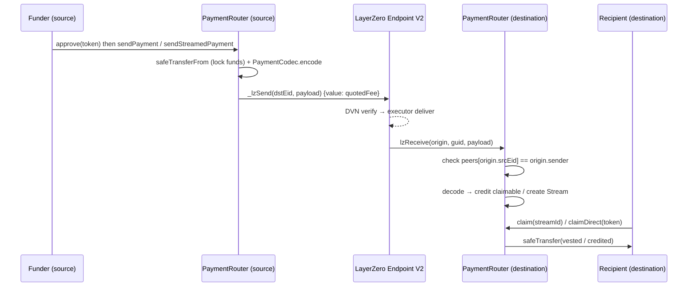

# Architecture

CrossPay routes payments across chains via LayerZero V2. A sender locks funds on
a source chain; the recipient claims them on a destination chain, with no bridge
UI, no source-chain gas, and no action beyond `claim()`.

## Flow

1. **Send** — the router pulls tokens with `safeTransferFrom` (non-custodial
   lock), encodes a versioned payload, and forwards it through LayerZero,
   paying the fee in native gas (quoted ahead of time via `quoteSend*`).
2. **Receive** — `lzReceive` verifies the caller is the endpoint and the sender
   is the registered peer, then decodes the payload and either credits
   `claimable[recipient][token]` or mints a `Stream`.
3. **Claim** — the recipient withdraws vested/credited funds with `safeTransfer`.

## Components

| Component | Role |
| --------- | ---- |
| `PaymentRouter` | OApp + escrow/vesting/claim logic; the only deployed business contract. |
| `PaymentCodec` | Versioned, ABI-based encode/decode of the wire payload. |
| `ICrossChainTransport` | Transport abstraction (send/receive bytes) so LayerZero can be swapped for CCIP/Hyperlane. |
| `IPaymentRouter` | Public interface: functions, events, custom errors. |
| `MockUSDC` | 6-decimal mintable test token. |

## Wire format

Payloads are headed by a `uint8 version` (currently `1`) followed by an enum
discriminator, then fields:

- Direct: `(version, PaymentType.Direct, recipient, token, amount, 0, 0)`
- Stream: `(version, PaymentType.Stream, recipient, token, totalAmount, periods, periodDuration)`

## Storage layout

`Stream` packs into 3 slots (see `DECISIONS.md` D10); validate with
`forge inspect PaymentRouter storage-layout`.

## Security model

- Peer-verified inbound messages (endpoint + `peers` check in `lzReceive`).
- `nonReentrant` on all fund-moving functions; Checks-Effects-Interactions.
- `Pausable` blocks sends and inbound processing, **never** claims.
- `rescueTokens` structurally cannot touch `supportedTokens`.
- See `SECURITY.md` for trust assumptions and limitations.
