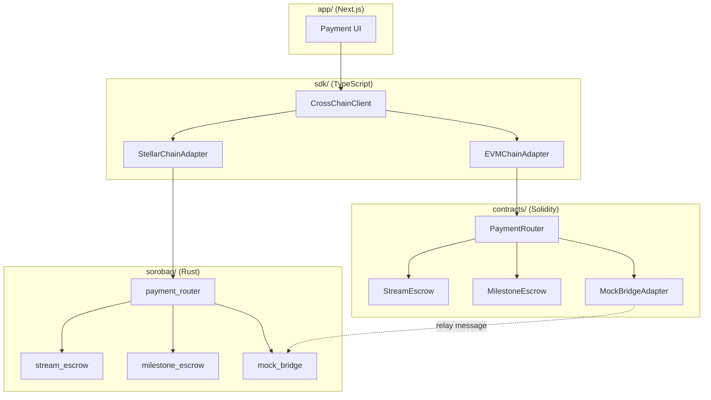

# Architecture

This document describes the components of **cross-chain-payments** and how a
payment flows through them. It is the implementation companion to
[`PROTOCOL_SPEC.md`](PROTOCOL_SPEC.md).

## Component overview



## Components

### PaymentRouter (`contracts/src/PaymentRouter.sol`, `soroban/src/payment_router.rs`)

The single entry point on each chain. It is deployed per-chain and configured
with that chain's `chainId`.

**Source-chain responsibilities**

1. Validate payment input (non-zero amount, non-zero recipient, valid timeout).
2. Allocate the next per-sender nonce.
3. Encode the canonical `CrossChainMessage` (see `PROTOCOL_SPEC.md` §4).
4. Deploy and fund the matching escrow (stream or milestone), or lock funds
   for a one-time payment.
5. Hand the opaque payload to the bridge adapter via `sendMessage`.

**Destination-chain responsibilities**

1. Receive a message via `receiveMessage` (bridge-only).
2. Reject messages whose `destChainId` does not match this chain.
3. Reject replays via the `delivered[sourceChainId][nonce]` set.
4. Record the announcement so status queries can confirm delivery.

### Escrows (`StreamEscrow`, `MilestoneEscrow`)

Per-payment contracts that custody funds. They hold assets only for a single
payment — there is no pooled vault — so custody is non-custodial with respect
to the protocol operators. Their state machines are specified in
`PROTOCOL_SPEC.md` §5.

- **StreamEscrow** — linear per-second accounting, `withdraw()` for the
  recipient, `cancel()` for the sender with pro-rata settlement, and
  division-dust refund at funding time.
- **MilestoneEscrow** — tranche-based release via multisig (`m-of-n`), DAO
  vote, or oracle attestation, plus a timeout fallback that lets the sender
  recover unreleased funds after `releaseDeadline`.

### Bridge adapter (`IBridgeAdapter`, `MockBridgeAdapter`, `mock_bridge`)

The transport abstraction. The router only ever calls `sendMessage` /
`receiveMessage`; it never knows which bridge (LayerZero, Axelar, Wormhole, or
the in-memory mock) carries a message. The `MockBridgeAdapter` is a
per-chain router registry that simulates delivery for local/testnet
development. A real adapter can be dropped in later without touching escrow
logic.

### TypeScript SDK (`sdk/`)

A chain-agnostic client that delegates to per-chain adapters implementing the
`ChainAdapter` interface:

```text
CrossChainClient
  ├── EVMChainAdapter      (viem + deployed router ABI)
  └── StellarChainAdapter  (@stellar/stellar-sdk + deployed router)
```

## Data flow: streamed payment (EVM → Soroban)

```mermaid
sequenceDiagram
    participant F as Funder (EVM)
    participant R as PaymentRouter (EVM)
    participant E as StreamEscrow (EVM)
    participant B as Bridge Adapter
    participant RD as PaymentRouter (Soroban)
    participant P as Recipient (Soroban)

    F->>R: streamPayment(token, amount, destToken, recipient, destChainId, duration, timeout)
    R->>R: nonce = nextNonce(sender); encode message
    R->>E: deploy + transferFrom + fund()
    R->>B: sendMessage(payload, destChainId)
    B->>RD: receiveMessage(payload)
    RD->>RD: replay-check + record announcement
    Note over P,E: recipient withdraws accrued amount anytime on source escrow
```

The message that reaches the destination chain carries the payment's *intent*
(amount, mode, metadata) so the destination can confirm delivery and index the
payment. Actual token settlement happens on the escrow where the funds were
custodied.

## Design invariants

1. **Bridge-agnostic escrows.** Escrow accounting never branches on the bridge
   implementation.
2. **Exactly-once delivery.** `delivered[sourceChainId][nonce]` guarantees a
   message is processed once even if the bridge redelivers.
3. **No stranded funds.** Every path out of an escrow is either a release to
   the recipient, a refund to the sender, or a pro-rata split on cancellation —
   enforced by the accounting invariants in `PROTOCOL_SPEC.md` §5.
4. **Replay-safe.** Per-sender nonces on the source chain + nonce tracking on
   the destination chain.
